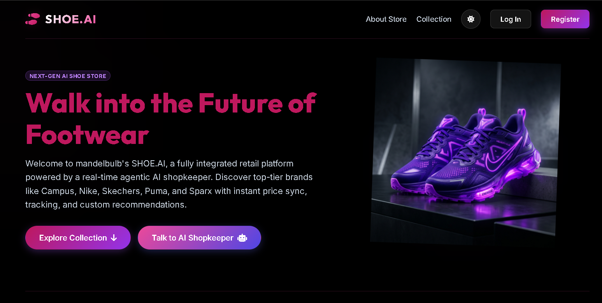
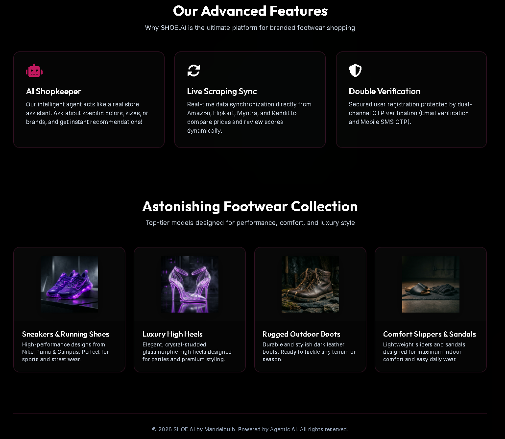
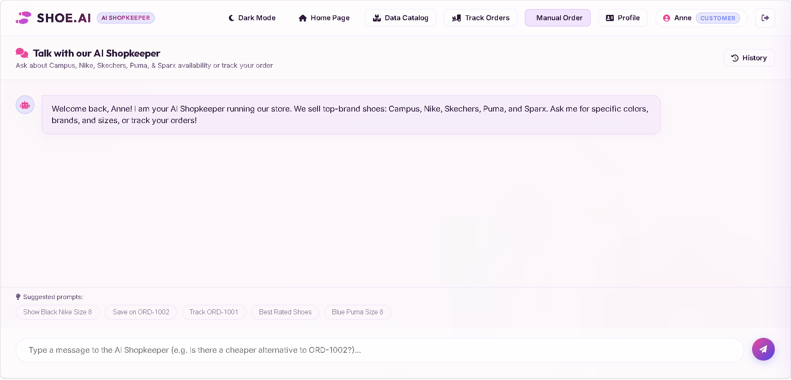
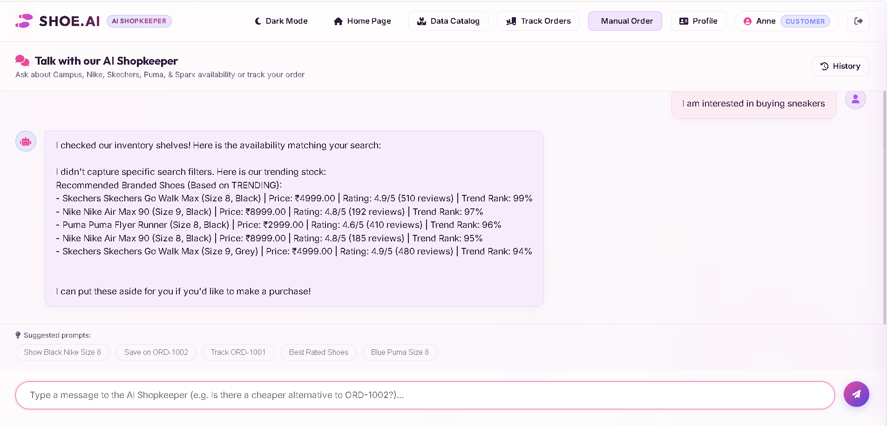
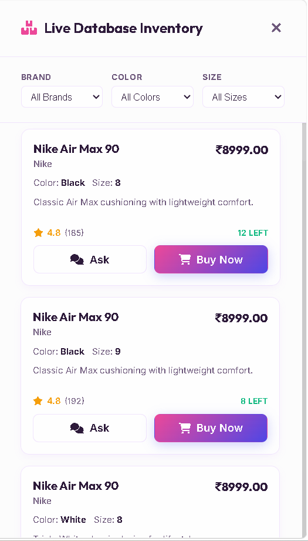
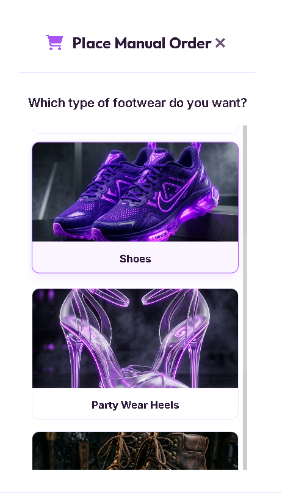
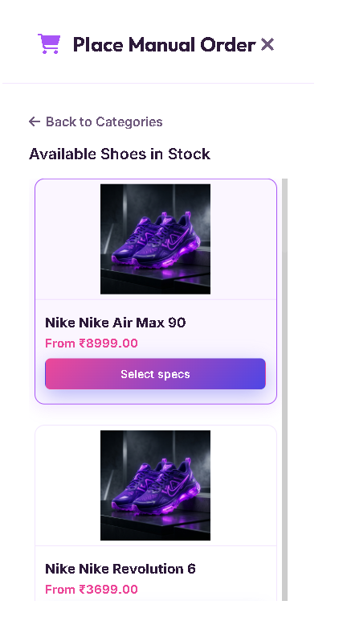
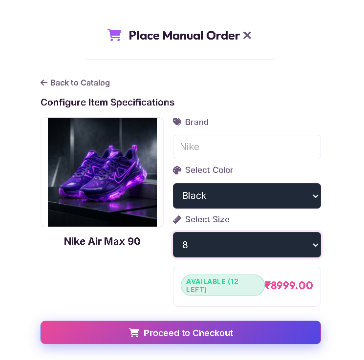
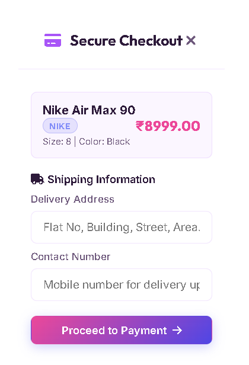
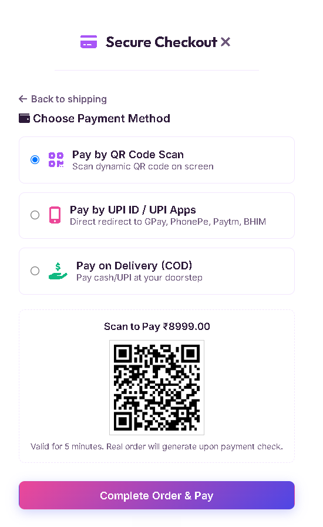

# Branded Shoe Store AI Agent (AI Shopkeeper)

A production-grade **Agentic AI Branded Shoe Store Assistant** built as a fresh interview submission for **Mandelbulb Technologies**. 

Rather than a simple CRUD application, this project simulates a real-life shopkeeper running a branded shoe business (selling **Campus, Nike, Skechers, Puma, Sparx**). It utilizes agentic AI loops (Intent Detection, Tool Selection, Tool Chaining, and Response Synthesis) with high-speed **Groq LLM Llama-3 models** and a **live trace logging console** for complete observability.

---

## 🌟 Core Features

* **JWT Authentication**: Full registration, login, and secure token lifecycle.
* **Specialized Shopkeeper Persona**: Advanced Groq prompts force the LLM to behave like a polite, to-the-point e-commerce business owner.
* **Real-time Inventory Ingestion**: Simulates scraping APIs for **Amazon, Flipkart, Myntra, and Reddit** to live-sync prices, stock levels, and review sentiments.
* **Smart Recommendation Engine**: If a specific size, color, or brand is out of stock, the agent queries database records for the **most trending** or **best-reviewed** alternatives.
* **Observability Trace Console**: Displays a terminal-style output of the agent's internal thoughts, tool sequences, database queries, and scraping status.
* **Interactive Data Catalog**: Drawers sliding out to display the live database contents. Users can click any shoe card to auto-generate and run chat prompts.
* **Admin Management Portal**: Restricted to `ADMIN` users to add new shoe items or delete existing ones in real-time, updating the catalog.
* **Delete Account Facility**: Securely delete user records permanently with validation checks.
* **Email Notifications**: Triggers welcome emails via `spring-boot-starter-mail` on user/admin sign-ups.

---

## ⚙️ Architecture Workflow

```text
User Question (Chat) -> [Headers JWT Validation] -> AgentController
                                                       │
                                                       ▼
                                                AgentOrchestrator
                                                       │
         ┌─────────────────────────────────────────────┴─────────────────────────────────────────────┐
         ▼                                                                                           ▼
 [Intent Classifier]                                                                          [Tool Selector]
Detects: TRACK_ORDER,                                                                          Formulates plan:
SEARCH_PRODUCT,                                                                                OrderTool -> ProductTool
CHEAPER_ALTERNATIVE                                                                            -> ProductSearchTool
         │                                                                                           │
         ▼                                                                                           ▼
   [Groq / Local]                                                                             [Plan Executor]
   Reasoning Core                                                                          Invokes DB and Scrapers
         │                                                                                           │
         └─────────────────────────────────────────────┬─────────────────────────────────────────────┘
                                                       │
                                                       ▼
                                            [Response Generator]
                                      Synthesizes shopkeeper response
                                                       │
                                                       ▼
                                            User Interface Bubble
```

---

## 📂 Project Structure

```text
online-store-agent/
│
├── backend/
│   ├── src/main/java/com/storeagent/
│   │   ├── agent/                 # AI Reasoning core, Tools, and Orchestrator
│   │   │   ├── llm/               # GroqLlmService and FallbackLlmService
│   │   │   ├── tools/             # OrderTool, ProductTool, ProductSearchTool, RecommendationTool
│   │   │   └── AgentOrchestrator.java
│   │   ├── config/                # SecurityConfig, JwtFilter, CorsConfig
│   │   ├── controller/            # AuthController, AgentController, AdminController
│   │   ├── entity/                # User, Product, Order (JPA Entities)
│   │   ├── repository/            # User, Product, Order (JPA Repositories)
│   │   ├── service/               # AuthService, EmailService, ProductSyncService, ExternalPlatformService
│   │   ├── dto/                   # JWT & REST Requests/Responses DTOs
│   │   └── util/                  # JwtUtil
│   │
│   ├── src/main/resources/
│   │   ├── application.properties # Common variables
│   │   ├── application-dev.properties # Local H2 Database setup
│   │   ├── application-prod.properties # MySQL 8 production setup
│   │   ├── schema.sql             # DB creation queries
│   │   └── data.sql               # Seed inventory and demo users
│   │
│   └── Dockerfile
│
├── frontend/                      # Static assets hosted on Vercel/Netlify/S3
│   ├── css/
│   │   └── style.css              # Custom HSL glowing dark glassmorphic design
│   ├── js/
│   │   └── app.js                 # API connections, states, console logging animations
│   └── index.html                 # Grid workspace panels
│
├── docker-compose.yml             # Single-command app + db orchestration
├── ECLIPSE_GUIDE.md               # Guide to import project into Eclipse IDE
├── DEPLOYMENT.md                  # Deployment options, configurations & profile switching
└── README.md
```

---

## 🔑 Default Accounts Seeding

We have pre-seeded two demo accounts in `data.sql` with encrypted passwords for quick testing:

| Username | Password | Role | Features |
|---|---|---|---|
| **`customer`** | `customer123` | `CUSTOMER` | Place queries, search shoes, track orders, request cheaper alternatives. |
| **`admin`** | `admin123` | `ADMIN` | Access **Admin Panel**, add new stock, delete stock from DB, view all customer orders. |

---

## 🚀 Quick Start Instructions

1. **Backend Execution (H2 Dev Profile)**:
   Ensure you have JDK 25+ installed. Run the commands in your terminal:
   ```bash
   cd backend
   # For Maven execution (we installed Maven locally in D:\Intern_Projects\AGENTIC_AI_PROJECT_MANDELBULB\maven):
   D:\Intern_Projects\AGENTIC_AI_PROJECT_MANDELBULB\maven\apache-maven-3.9.6\bin\mvn.cmd spring-boot:run
   ```
2. **Frontend UI**:
   - Locate the `frontend` folder.
   - Open `index.html` in any web browser.
   - Log in using one of the accounts above and start testing!
3. **LLM Connection**:
   - Paste your **Groq API Key** directly into the input slot in the UI's console header. It is temporarily applied to queries and not stored on the server for safety.

---
---

# 📸 Application Screenshots

## 🏠 Landing Page

<p align="center">
  
</p>

---

## ✨ Features & Collections Section

<p align="center">
  
</p>

---

## 🤖 AI Shopkeeper Dashboard

<p align="center">
  
</p>

---

## 💬 AI Recommendation Response

<p align="center">
  
</p>

---

## 📦 Live Inventory Catalog

<p align="center">
  
</p>

---

## 🛒 Manual Order Workflow

<table align="center">
<tr>
<td align="center">

### Select Footwear Category



</td>

<td align="center">

### Select Product



</td>
</tr>

<tr>
<td align="center">

### Configure Product Specifications



</td>

<td align="center">

### Shipping Details



</td>
</tr>
</table>

---

## 💳 Payment Options

<p align="center">
  
</p>

---

## 🎯 Complete User Journey

```text
Landing Page
      ↓
Login / Registration
      ↓
AI Shopkeeper Interaction
      ↓
Browse Inventory
      ↓
Select Product Category
      ↓
Choose Product
      ↓
Configure Size & Color
      ↓
Enter Shipping Details
      ↓
Select Payment Option
      ↓
Order Confirmation
```

---

## 🛠️ Developer Configurations & Guides
- Review **[ECLIPSE_GUIDE.md](file:///d:/Intern_Projects/AGENTIC_AI_PROJECT_MANDELBULB/ECLIPSE_GUIDE.md)** for importing the Maven folder in Eclipse IDE.
- Review **[DEPLOYMENT.md](file:///d:/Intern_Projects/AGENTIC_AI_PROJECT_MANDELBULB/DEPLOYMENT.md)** to configure Docker Compose and run on MySQL 8 databases.
